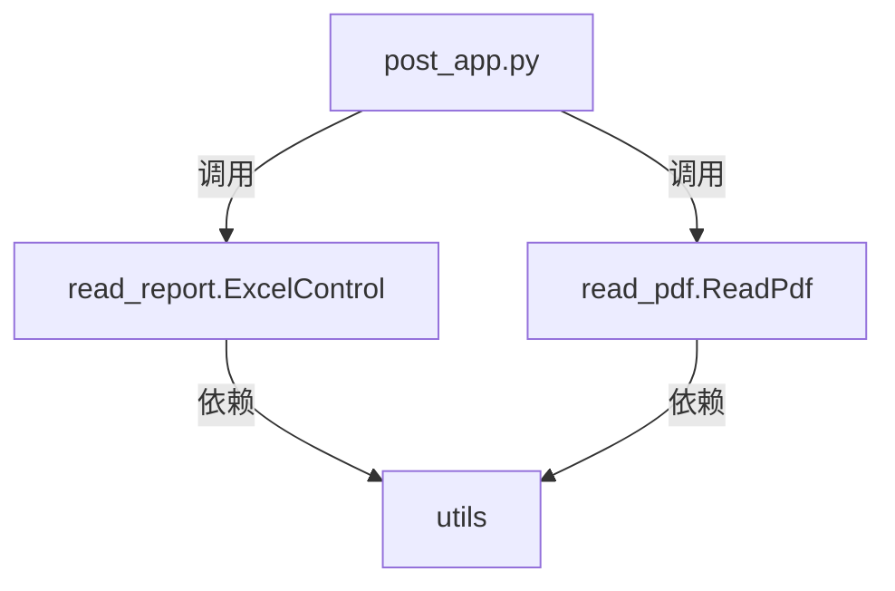
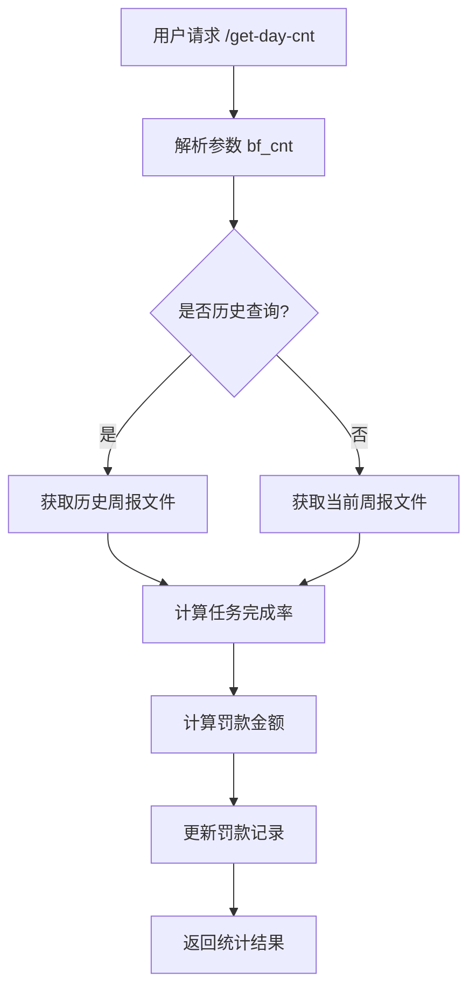
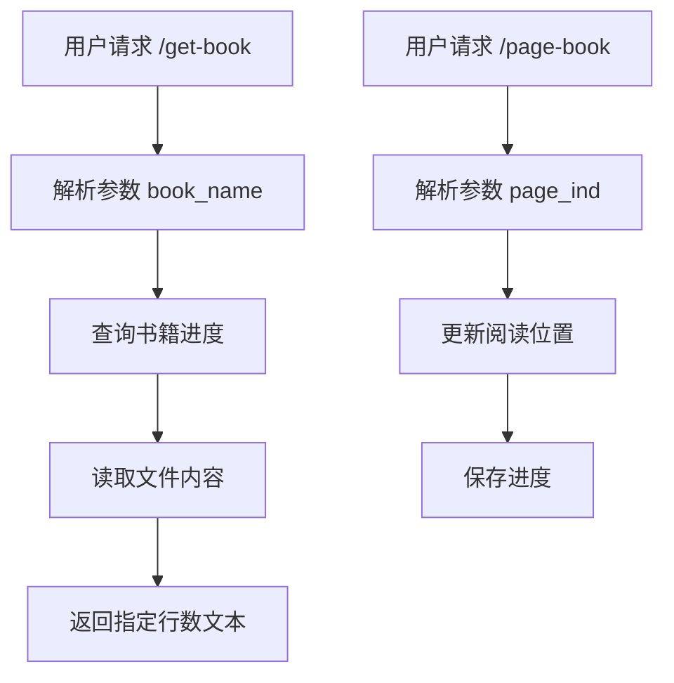
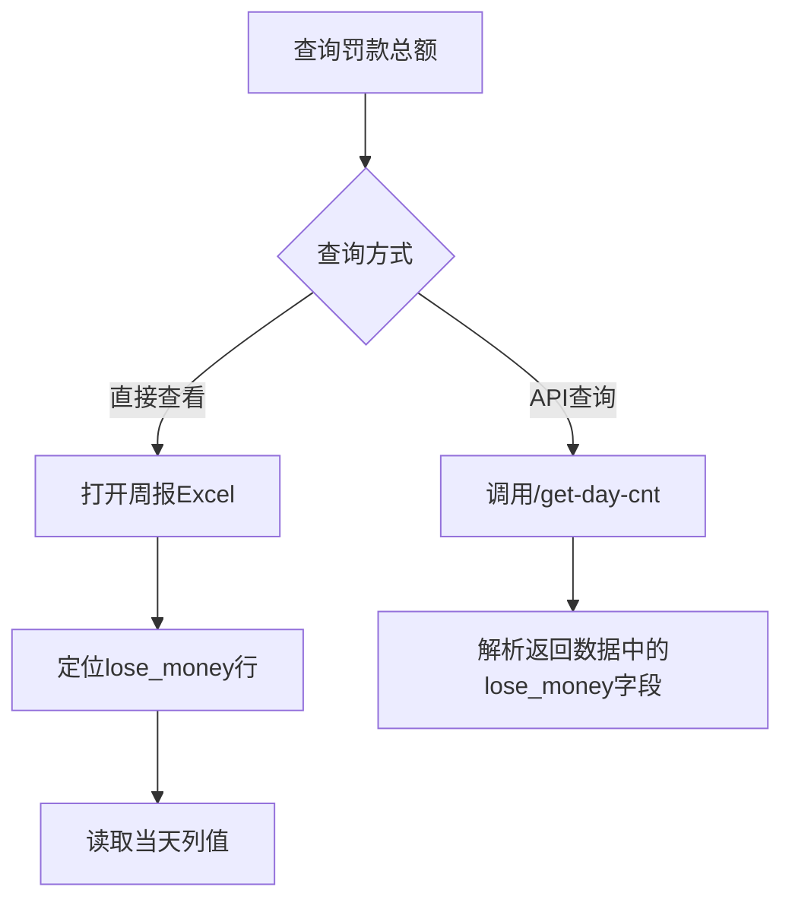

# 任务统计与书籍管理系统流程文档

## 项目概述
基于Flask的任务统计和书籍管理系统，主要功能：
- 任务打卡统计（完成进度、罚款计算）
- 书籍阅读管理（分页阅读、进度更新）
- 数据存储：周报Excel（2025_*.xlsx）、书籍进度（book_helper.xlsx）

## 核心模块关系


## 关键函数说明

### 流程图
#### 任务打卡统计流程


#### 书籍阅读管理流程


#### 罚款查询流程（新增）


### post_app.py
- `handle_get_day_cnt()`：查询当日任务进度
  - 参数：`bf_cnt`（历史天数偏移）
  - 调用链：`ExcelControl().get_cur_week_file()` → `get_hour_task_expect_cnt()`
- `handle_add_day_point()`：打卡/减卡操作
  - 参数：`task_name`, `update_type`, `day_ind`
  - 核心逻辑：`ExcelControl().update_df_new()`
- `handle_get_book()`：获取书籍内容
  - 参数：`book_name`, `page_rows`
  - 调用：`ReadPdf().read_book()`
- `handle_page_book()`：更新阅读位置
  - 参数：`book_name`, `page_ind`
  - 调用：`ReadPdf().update_start_line()`

### read_report.py
- `get_hour_task_expect_cnt()`：计算未完成任务数
  ```python
  # 公式
  (任务目标/7*2)/8*已过小时数 - 当日完成数
  ```
- `get_money()`：罚款计算（关键更新）
  - **罚款规则**：
    - 未完成任务：每小时罚款400元
    - 计算公式：`罚款总额 = 未完成任务数 × 400 × 2`
  - **存储位置**：
    - 周报Excel的`lose_money`行
    - 示例：`2025_28.xlsx`中周一的罚款值
- `update_df_new()`：更新打卡记录
  - 参数：`update_type=True`（加卡）, `False`（减卡）

### read_pdf.py
- `read_book()`：书籍阅读流程
  ```python
  1. 通过book_helper.xlsx查询进度
  2. 读取file_path中指定行数内容
  ```
- `update_start_line()`：进度更新
  - 参数：`is_done=1`（前进）, `0`（后退）

### utils.py
- `log_init()`：日志系统初始化
- `read_df()`/`write_df()`：Excel读写封装
- `find_keyword_in_file()`：文本关键词搜索

## 数据结构

### 周报Excel (2025_*.xlsx)
| 项目        | 目标 | 周一 | 备注1 | 周二 | 备注2 | ... | 周日 | 备注7 |
|-------------|------|------|-------|------|-------|-----|------|-------|
| machin_learn| 70   | 5.0  | {10:1}| 3.0  | {12:1}| ... |      |       |
| **lose_money** |      | **200** |       | 150  |       | ... |      |       |

> 罚款总额存储在`lose_money`行，对应日期列（如周一列值为200元）

### 书籍进度 (book_helper.xlsx)
| 任务名     | 文件路径                     | 页码  | 完成状态 |
|------------|------------------------------|-------|----------|
| deepl      | /opt/code/post_app/deepl.txt | 11405 | 0        |
| 2305_11344 | /opt/code/post_app/2305_11344.txt | 320   | 1        |

## API接口规范
| 端点             | 方法 | 参数                      | 响应示例                          |
|------------------|------|---------------------------|-----------------------------------|
| `/get-day-cnt`   | GET  | `bf_cnt=0`                | `{"response":"summery:{..., 'lose_money':200}"}` |
| `/add-day-point` | GET  | `task_name=machin_learn&update_type=1` | `{"response":"ok"}`              |
| `/get-book`      | GET  | `book_name=deepl&page_rows=30` | 书籍文本内容                     |
| `/page-book`     | GET  | `book_name=deepl&page_ind=11500` | `{"status":"success"}`           |
| **`/get-day-fine`** | **GET** | **`bf_cnt=0`** | **`{"fine_total":200}`** |

> 新增`/get-day-fine`API专用查询罚款总额（需后续开发实现）

## 部署运行
```bash
nohup python post_app.py >> post_app.log &
```

# 罚款查询指南
## 方式1：直接查看Excel
1. 打开对应周报文件（如`2025_28.xlsx`）
2. 找到`lose_money`行
3. 查看当天列的值（如周一列）

## 方式2：通过现有API
```bash
# 调用/get-day-cnt接口
curl "http://localhost/get-day-cnt?bf_cnt=0"

# 解析返回数据中的lose_money字段
{
  "response": "summery:{..., 'lose_money':200} ; ..."
}
```

## 方式3：通过专用API（待开发）
```bash
curl "http://localhost/get-day-fine?bf_cnt=0"
# 响应: {"fine_total":200}
```

> 文档更新时间：2025-07-08 14:10:00